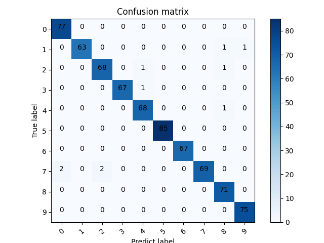

# bearing fault diagnosis

This is the official baseline of paper: [*Bearing fault diagnosis base on multi-scale CNN and LSTM model*](https://doi.org/10.1007/s10845-020-01600-2)

Dataset: [CWRU bearing data center](https://engineering.case.edu/bearingdatacenter/welcome).
Put the `.mat` files in the `./data` foler.  

If you find this paper helpful, Welcome to cite it!
> Chen, X., Zhang, B. & Gao, D. Bearing fault diagnosis base on multi-scale CNN and LSTM model. J Intell Manuf (2020). https://doi.org/10.1007/s10845-020-01600-2

## See also

Deep Transfer Learning for Bearing Fault Diagnosis: A Systematic Review Since 2016. [[paper]](https://ieeexplore.ieee.org/abstract/document/10042467) [[code]](https://github.com/Xiaohan-Chen/fault-diagnosis-transfer-learning-pytorch)

## My_test

### 先安装依赖库

    pip install -r requirements.txt

### 测试

先运行get_data.py爬取CWRU数据集，再运行MCNN_LSTM.py可开始训练并最后得到一个测试集的10*10的混淆矩阵

